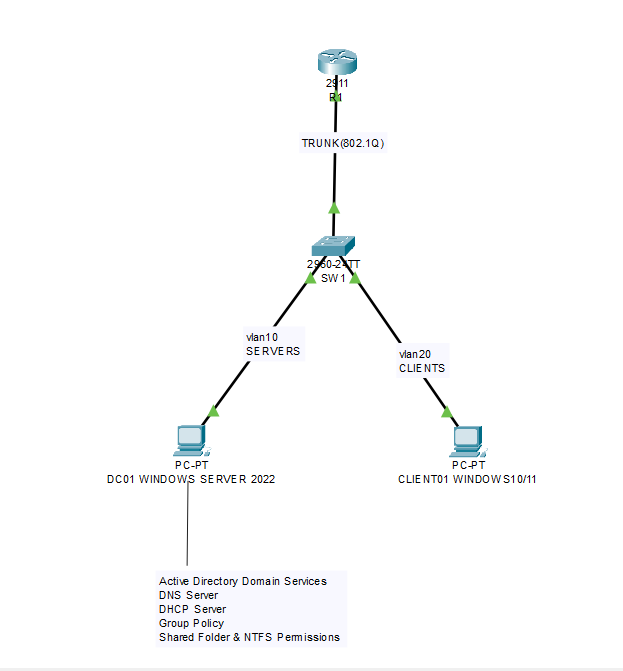

# 🏢 Enterprise Network Infrastructure using Windows Server 2022 and Cisco Packet Tracer


## 🖥️ Enterprise Windows Server Administration Lab

A complete enterprise-grade Windows Server 2022 infrastructure built using VMware Workstation Pro and Cisco Packet Tracer. This project demonstrates real-world implementation of Active Directory, DNS, DHCP, Group Policy, File Sharing, VLANs, and Inter-VLAN Routing within a simulated enterprise network.

## Overview

This project demonstrates the design, implementation, and validation of a **Windows Server 2022–based enterprise network** integrated with **Cisco networking technologies**. The lab environment simulates a real-world organizational infrastructure and showcases practical skills in Windows Server administration, Active Directory, network services, security policies, and Cisco networking.

The environment was built using **VMware Workstation Pro** for virtualization and **Cisco Packet Tracer** for network topology design.

## 🎯 Project Summary

This project was independently designed and implemented to demonstrate enterprise-level Windows Server administration and Cisco networking skills. The objective was to simulate a real-world organizational environment by integrating Active Directory, DNS, DHCP, Group Policy, secure file sharing, and VLAN-based networking. The implementation emphasizes practical system administration, network configuration, centralized management, and troubleshooting techniques commonly used in enterprise IT environments.

---

## Features

- Windows Server 2022 Domain Controller Deployment
- Active Directory Domain Services (AD DS)
- DNS Server Configuration
- DHCP Server Configuration
- Active Directory Users and Organizational Units (OUs)
- Security Groups
- Shared Folder Configuration
- Share & NTFS Permissions
- Group Policy Objects (GPO)
- Automatic Network Drive Mapping
- Cisco VLAN Configuration
- IEEE 802.1Q Trunking
- Router-on-a-Stick Inter-VLAN Routing
- Enterprise Network Testing and Troubleshooting

---

## Technologies Used

### Operating Systems

- Windows Server 2022
- Windows 10

### Virtualization

- VMware Workstation Pro

### Networking

- Cisco Packet Tracer
- Cisco Router
- Cisco Catalyst 2960 Switch

### Windows Server Roles

- Active Directory Domain Services (AD DS)
- DNS Server
- DHCP Server
- File and Storage Services
- Group Policy Management

---

## Network Topology

The enterprise lab consists of:

- Windows Server 2022 Domain Controller (**DC01**)
- Windows 10 Client (**CLIENT01**)
- Cisco Router
- Cisco Layer-2 Switch
- VLAN 10 (Servers)
- VLAN 20 (Clients)

The router provides **Inter-VLAN Routing** using the **Router-on-a-Stick** technique.

> **Network Topology**

<p align="center">

</p>

---

## IP Addressing Scheme

| Device | IP Address |
|---------|------------|
| DC01 | 192.168.10.10 |
| Router VLAN10 Gateway | 192.168.10.1 |
| Router VLAN20 Gateway | 192.168.20.1 |
| CLIENT01 | DHCP Assigned |
| DNS Server | 192.168.10.10 |

---

## Windows Server Services Implemented

### Active Directory

- Domain Creation
- Organizational Units
- User Accounts
- Security Groups
- Domain Join

### DNS

- Forward Lookup Zone
- Reverse Lookup Zone
- A Records
- CNAME Records
- PTR Records

### DHCP

- DHCP Scope
- Dynamic IP Address Allocation
- Address Lease Management

### Group Policy

- Control Panel Restriction
- Automatic Network Drive Mapping

### File Sharing

- SMB Shared Folder
- Share Permissions
- NTFS Permissions
- Security Group-Based Access Control

---

## Cisco Network Configuration

The Cisco network includes:

- VLAN Configuration
- Access Ports
- IEEE 802.1Q Trunking
- Router-on-a-Stick Configuration
- Inter-VLAN Routing

---

## Testing and Validation

The following functionalities were successfully validated:

- ✅ Client receives IP address via DHCP
- ✅ Successful Domain Join
- ✅ Domain User Login
- ✅ DNS Forward Lookup
- ✅ DNS Reverse Lookup
- ✅ Group Policy Application
- ✅ Shared Folder Access
- ✅ Automatic Network Drive Mapping
- ✅ VLAN Connectivity
- ✅ Inter-VLAN Routing

---

## 📂 Repository Contents

- 📄 Complete Project Documentation
- 📄 README
- 🖼️ Network Topology
- 📷 30+ Configuration Screenshots
- 🌐 Cisco Packet Tracer File
- 💻 VMware Lab Configuration

## Repository Structure

```text
Enterprise-Network-Infrastructure/
│
├── README.md
├── Project_Report.pdf
├── PacketTracer/
│   └── Enterprise_Network.pkt
├── Documentation/
│   └── Project_Documentation.doc
├── Screenshots/
│   ├── Figure1.png
│   ├── Figure2.png
│   ├── ...
│   └── Figure15.png
└── Images/
    └── Network_Topology.png
```

## 🚀 Learning Outcomes

After completing this project, I gained practical experience in:

- Building an Active Directory domain from scratch.
- Managing users, groups, and Organizational Units.
- Deploying enterprise DNS and DHCP services.
- Implementing Group Policy for centralized management.
- Configuring secure file sharing with Share and NTFS permissions.
- Designing VLAN-based enterprise networks.
- Configuring Inter-VLAN Routing using Router-on-a-Stick.
- Troubleshooting enterprise networking and Windows Server issues.

---

## ⭐ Key Highlights

- Designed and deployed a complete Windows Server 2022 enterprise infrastructure.
- Configured Active Directory Domain Services (AD DS) with Organizational Units and Security Groups.
- Implemented DNS with Forward Lookup Zone, Reverse Lookup Zone, A, PTR, and CNAME records.
- Configured DHCP for automatic IP address allocation.
- Implemented Group Policy Objects (GPO) for centralized administration.
- Configured secure SMB shared folders using Share and NTFS permissions.
- Automated network drive mapping using Group Policy Preferences.
- Designed VLAN-based enterprise network using Cisco Packet Tracer.
- Configured Router-on-a-Stick for Inter-VLAN Routing.
- Performed end-to-end testing and troubleshooting to validate the enterprise network.
---

## Future Improvements

- Deploy a Secondary Domain Controller
- Configure DFS (Distributed File System)
- Implement Windows Server Backup
- Configure WSUS
- Deploy Network Access Control (NAC)
- Integrate Microsoft Entra ID (Azure AD)
- Configure VPN for Remote Access
- Integrate SIEM for Centralized Log Monitoring

---

## Documentation

Detailed implementation steps, screenshots, configuration procedures, testing results, and troubleshooting information are available in the project documentation included in this repository.

---

## 📈 Skills Gained

### Windows Server Administration

- Active Directory
- DNS
- DHCP
- Group Policy
- File Server
- NTFS Permissions
- Share Permissions
- Windows Server Roles

### Networking

- VLAN Configuration
- Router-on-a-Stick
- Cisco Switching
- Cisco Routing
- IP Address Planning
- DNS Resolution
- DHCP Configuration

### System Administration

- VMware Virtualization
- Domain Administration
- Enterprise Troubleshooting
- Network Documentation
- Security Group Management

## Screenshots

The complete project screenshots are available inside the **Screenshots** folder.

Example screenshots include:

- Server Manager Dashboard
- Active Directory Users and Computers
- DNS Manager
- DHCP Manager
- Group Policy Management
- Shared Folder Permissions
- Network Drive Mapping
- Cisco Packet Tracer Topology

---
## 👨‍💻 Author

**Ashish Pathak**

Computer Science Engineering Student

### Interests

- Network Engineering
- Windows Server Administration
- Cybersecurity
- System Administration
- Enterprise Infrastructure

### GitHub

https://github.com/ASura12

If you found this project helpful, consider giving it a ⭐ on GitHub.

## License

This project was developed independently for learning, portfolio demonstration, and practical enterprise networking experience. It may be freely used for educational and non-commercial purposes.
